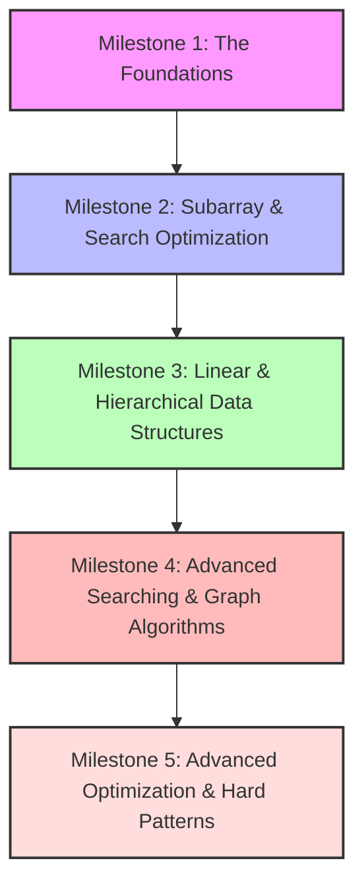

# Beginner's DSA Roadmap & Topic Guide

This guide is designed to take a absolute beginner and build them up to an interview-ready problem solver. It divides your learning journey into **5 distinct milestones**. 

Before moving to the next milestone, ensure you have understood the prerequisite topics and solved the respective problems.

---

---

## 🎯 Milestone 1: The Foundations (Arrays, Hashing & Basic Math)

This is where your coding journey begins. You will learn to store items in lists and search them efficiently using associative dictionaries.

### 📚 What you need to understand BEFORE starting:
1. **Programming Language Basics**: Variables, loops (`for` and `while`), lists/arrays, conditional statements (`if-else`), and functions.
2. **Space & Time Complexity (Big O)**: What makes an algorithm run in $O(1)$ constant time, $O(N)$ linear time, or $O(N^2)$ quadratic time.
3. **Hash Maps and Sets**: How a dictionary/hash set works under the hood (keys, values, unique constraints, and $O(1)$ retrieval).

### 🚀 Topics & Project Categories:
* **Arrays**: Linear lists of items stored next to each other in memory.
* **Hashing**: Creating lookup indices for constant-time comparisons.
* **Basic Bitwise Operations**: How numbers are represented in binary.

---

## 🎯 Milestone 2: Subarray & Search Optimization (Two Pointers, Sliding Window & Binary Search)

Once you can search and store items, you need to learn how to scan and find sub-segments within lists without doing redundant work.

### 📚 What you need to understand BEFORE starting:
1. **Sorted Arrays**: Why sorting is important, and how ordering changes search mechanics.
2. **Subarrays vs. Subsequences**: Understanding that subarrays are contiguous chunks of an array, while subsequences do not have to be contiguous.
3. **Pointers/Indices**: Manipulating index variables (`left` and `right`) to scan arrays from both ends or alongside each other.

### 🚀 Topics & Project Categories:
* **Two Pointers**: Collapsing or expanding intervals on sorted data.
* **Sliding Window**: Moving a variable-sized window to count unique ranges.
* **Binary Search**: Logarithmic $O(\log N)$ search spaces.

---

## 🎯 Milestone 3: Linear & Hierarchical Data Structures (Linked Lists, Stacks, Queues & Trees)

Now, you shift from simple arrays to complex structures connected by memory pointers, nested states, and parent-child hierarchies.

### 📚 What you need to understand BEFORE starting:
1. **Memory Pointers/References**: How variables point to memory addresses (`node.next`, `node.left`, `node.right`).
2. **Call Stacks & Recursion**: How a function calls itself, how call frames stack up, and what a "base case" is.
3. **FIFO vs. LIFO**: First-In-First-Out vs. Last-In-First-Out behaviors.

### 🚀 Topics & Project Categories:
* **Linked Lists**: Sequences of nodes connected by pointer addresses.
* **Stacks & Queues**: Validating balances and tracking order sequences.
* **Trees & BST**: Traversing levels using Depth-First Search (DFS) and Breadth-First Search (BFS).

---

## 🎯 Milestone 4: Advanced Searching & Graph Algorithms (Heaps, Backtracking & Basic Graphs)

You will learn to manage real-time queues, explore all possible configurations recursively, and traverse complex network relationships.

### 📚 What you need to understand BEFORE starting:
1. **Tree Traversals**: DFS (Preorder, Inorder, Postorder) and BFS.
2. **Adjacency Lists/Matrices**: How to represent a network of connected nodes (graphs) using dictionary lists.
3. **Recursion Depth**: The mechanics of keeping track of path histories and reversing steps (backtracking).

### 🚀 Topics & Project Categories:
* **Heap / Priority Queue**: Finding top-K values and managing streaming inputs.
* **Backtracking**: Finding all possible combinations/permutations.
* **Graphs (BFS & DFS)**: Traversing networks, multi-source BFS, and topological sorting.

---

## 🎯 Milestone 5: Advanced Optimization & Hard Patterns (Greedy, Dynamic Programming & Advanced Graphs)

This is the final phase where you solve hard interview problems by optimizing recursive algorithms, detecting network cliques, and resolving interval collisions.

### 📚 What you need to understand BEFORE starting:
1. **Subproblem Substructures**: Identifying if a large problem (like reaching the $N$-th step) depends directly on the results of smaller versions of itself ($N-1$ and $N-2$).
2. **Caching (Memoization)**: Storing calculated results so you never compute the same branch twice.
3. **Union-Find Structure**: Tracking disjoint sets to merge networks.

### 🚀 Topics & Project Categories:
* **Greedy Algorithms**: Making the best immediate decision (handling intervals).
* **Dynamic Programming (DP)**: Bottom-up tabulation and top-down memoization.
* **Advanced Graphs**: Dijkstra's shortest path, Kruskal's/Prim's MST, and Union-Find.
